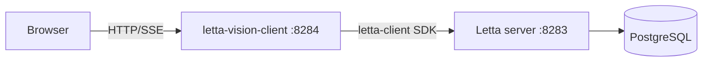

# letta-vision-client — architecture

Minimal web UI for self-hosted [Letta](https://github.com/letta-ai/letta): agent management, multi-conversation chat with SSE streaming, memory blocks, tools, models, and folder/file sources. Replaces ADE-style workflows for a single operator on their own server.

## Design principles

- **Letta is the system of record.** No bridge database; all state lives in Letta.
- **Expose Letta features** (memory blocks, tools, conversations, sources) rather than hiding them behind a generic chat shell.
- **Empirical limits only.** Do not cap list sizes or history unless a failure mode has been observed and documented (see [Operational notes](#operational-notes)).
- **PyPI SDK for API access.** Backend uses the official `letta-client` Python package — not hand-rolled REST.

## Stack

| Layer | Technology |
|-------|------------|
| Backend | Python 3.11+, FastAPI, uvicorn |
| Frontend | Vite 6, Svelte 5 (runes), static assets served by FastAPI |
| Letta API | `letta-client` from PyPI |
| Deploy | Multi-stage Docker image (Node build → Python runtime) |

## Repository layout

```
letta-vision-client/
├── Dockerfile
├── requirements.txt          # Python deps (no editable local package install)
├── docker-compose.yml        # Standalone container (optional)
├── .env.example
├── backend/
│   ├── main.py               # FastAPI app, static mount, routers
│   ├── config.py             # LETTA_BASE_URL, LETTA_SERVER_PASSWORD
│   ├── schemas.py
│   ├── sse.py                # SSE coalescing for chat streams
│   ├── letta_lists.py        # Paginated SDK list helpers
│   └── routes/               # /api/* handlers
├── frontend/
│   ├── src/
│   │   ├── App.svelte        # Tabs: Agents, Chat, Files
│   │   ├── lib/              # api.js, stores.js, UI components
│   │   └── routes/
│   └── vite.config.js        # Dev proxy: /api → localhost:8284
├── stress-tests/             # Load / limit discovery scripts
└── docs/
    └── ARCHITECTURE.md       # This file
```

## Runtime topology



In **[letta-vision-deploy](https://github.com/damonreed/letta-vision-deploy)**, the client uses `LETTA_BASE_URL=http://letta-vision:8283` on the Compose network. For local dev, point at `http://localhost:8283`.

## Configuration

| Variable | Default | Description |
|----------|---------|-------------|
| `LETTA_BASE_URL` | `http://letta-vision:8283` | Letta server URL (Compose service name or localhost) |
| `LETTA_SERVER_PASSWORD` | *(required)* | Letta server password / API key |
| `VISION_MAX_UPLOAD_BYTES` | `0` | Max folder upload size in bytes (`0` = unlimited) |

No auth between the browser and the vision client — intended for trusted local/LAN use. Harden with firewall rules or a reverse proxy (TLS, basic auth, VPN), not by exposing port 8284 publicly.

## Security

| Topic | Mitigation |
|-------|------------|
| **Trust model** | Anyone who can reach the UI can use your Letta credentials via the backend proxy. |
| **XSS (chat)** | Agent markdown is sanitized with DOMPurify before `{@html}` render. |
| **Uploads** | Filenames reduced to basename; optional `VISION_MAX_UPLOAD_BYTES` caps memory use. |
| **CORS** | `allow_origins=["*"]` — acceptable for local dev; tighten if you split origins. |
| **Errors** | 5xx responses use generic messages; 4xx may include Letta SDK text. |
| **Headers** | `X-Content-Type-Options`, `X-Frame-Options`, `Referrer-Policy` on all responses. |

See [SECURITY.md](../SECURITY.md) for reporting vulnerabilities.

## Backend API surface

All routes are under `/api`. Errors return `{"error": "..."}`.

| Area | Routes |
|------|--------|
| Agents | `GET/POST /api/agents`, `GET/PATCH/DELETE /api/agents/{id}` |
| Chat | `POST /api/agents/{id}/messages` (SSE stream), `GET /api/agents/{id}/history` |
| Conversations | `GET/POST /api/agents/{id}/conversations`, `PATCH/DELETE /api/conversations/{id}` |
| Memory (per agent) | `GET/POST/PATCH/DELETE /api/agents/{id}/blocks`, attach/detach |
| Blocks (global) | `GET/POST /api/blocks`, `GET/PATCH /api/blocks/{id}`, `GET /api/blocks/{id}/agents` |
| Tools | `GET /api/tools`, attach/detach on agent |
| Models | `GET /api/models`, `GET /api/embeddings` |
| Folders / files | Folder CRUD, file upload, agent folder attach/detach |

SDK list endpoints are drained via pagination helpers in `letta_lists.py` (no arbitrary `limit=50`-style caps on full collections).

## Frontend

- **Hash routing:** `#agents`, `#chat`, `#files`
- **localStorage keys** (prefix `letta-vision-client/`; legacy `letta-bridge/` keys are read once then migrated):
  - `selected-agent`
  - `active-conversation:{agent_id}`
  - `system-expanded-{agent_id}` (chat UI)
- **Chat:** Markdown rendering, reasoning blocks, tool call display, conversation sidebar, SSE via `fetch` + `ReadableStream`

## Docker

Build from repo root:

```bash
docker build -t letta-vision-client .
docker run -p 8284:8284 \
  -e LETTA_BASE_URL=http://host.docker.internal:8283 \
  -e LETTA_SERVER_PASSWORD=... \
  letta-vision-client
```

Or use `docker compose up` in this directory (see `docker-compose.yml`).

## Local development

```bash
# Backend
python3 -m venv .venv && source .venv/bin/activate
pip install -r requirements.txt
cp .env.example .env   # edit LETTA_SERVER_PASSWORD
LETTA_BASE_URL=http://localhost:8283 uvicorn backend.main:app --reload --port 8284

# Frontend (separate terminal)
cd frontend && npm install && npm run dev
```

Run `npm install` only inside `frontend/`. The UI repo is a **sibling** of `letta-vision-deploy/` (not nested inside it). Compose uses `build: ../letta-vision-client`.

## Operational notes

**Intentional non-limits** (not empirical caps): conversation preview `limit=1`, preview text truncation, memory block char budget aligned with Letta, UI toast timers, SSE keep-alive 300s in Dockerfile.

**Stress tests:** `stress-tests/` — run after substantive changes; record observed failure modes in project notes rather than adding defensive caps preemptively.

## Version history (features)

Consolidated from earlier bridge specs (Ada's action lists and memory-block spec):

| Version | Focus |
|---------|--------|
| v0.1 | Agents + chat + basic memory/tools/models |
| v0.2 | Agent PATCH, model filters, system message collapse, reasoning display |
| v0.3 | Conversations API, sidebar, per-agent active conversation |
| v0.4 | Global block registry, attach/detach, read-only blocks, shared-block indicator |
